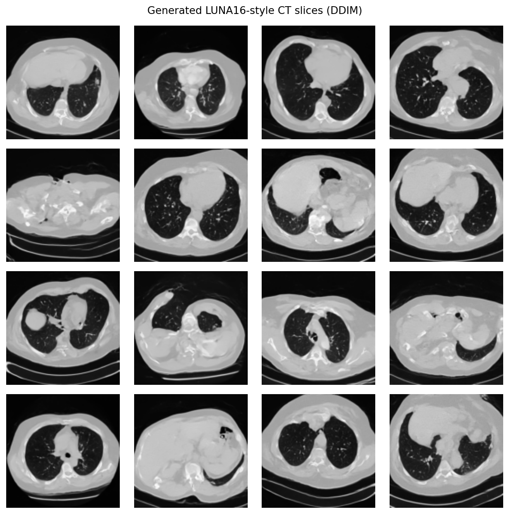
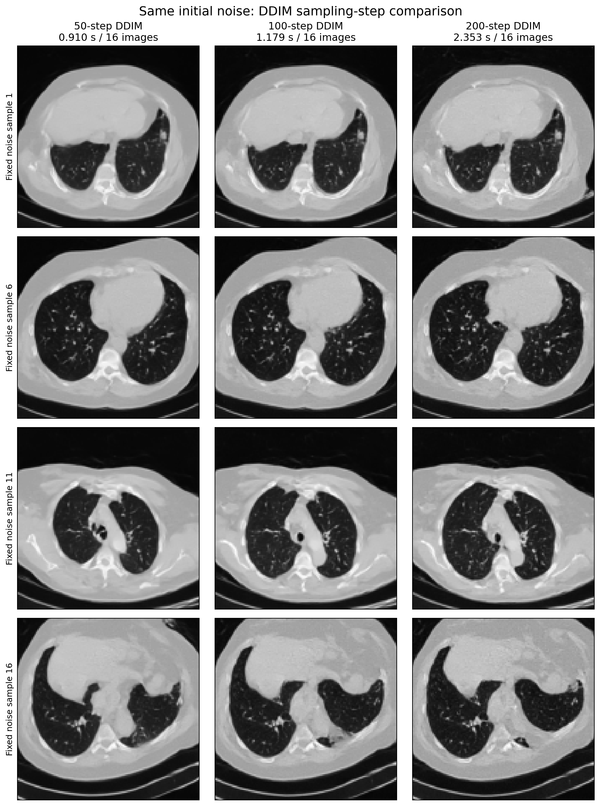

# LUNA16 二维 CT 扩散生成实验

项目使用 LUNA16 `subset0` 的 89 个 CT 扫描，完成了：

- 64×64、3000-step DDPM baseline；
- 128×128、10000-step improved experiment；
- 固定初始噪声下的 50/100/200-step DDIM 采样比较；
- 留出测试集灰度分布、样本多样性、训练集最近邻和失败案例分析。

128×128 实验将真实/生成灰度直方图 TV 距离从约 **0.326** 降至约 **0.245**。根据实际生成图片，100-step DDIM 是当前速度和视觉细节之间较合理的折中，但更多采样步数并不保证解剖结构更自然。

> **重要限制：** 本项目只是一项教学性质的生成实验。生成结果未经放射科医生评价，未验证结节或其他病灶真实性，不能用于临床诊断、治疗或决策。


本实验延续了仓库中的[生物医学图像生成文献综述](../deep-research-output/biomedical-image-generation/phase6_report/report.md)。综述讨论了 AE/VAE、GAN、自回归模型、Normalizing Flow 和 Diffusion；本实验选择 Diffusion 作为小规模二维教学基线，用于展示从随机噪声逐步生成 CT 的过程。

## 1. 项目结构

```text
luna16_2d_ct_generation/
├── configs/
│   ├── default.yaml
│   ├── improved_128.yaml
│   └── smoke.yaml
├── data/
│   ├── LUNA16/                       # 原始数据，不提交
│   ├── processed/                    # 本地生成，不提交
│   └── processed_improved_128/       # 本地生成，不提交
├── checkpoints/
│   └── README.md                     # 权重大小、SHA-256 与发布说明
├── outputs/
│   ├── baseline_vs_improved.png
│   └── improved_128/
├── reports/
│   ├── experiment_report.md
│   └── improved_128_experiment_report.md
├── dataset.py
├── download_subset0.py
├── evaluate.py
├── make_baseline_comparison.py
├── model.py
├── preprocess.py
├── requirements.txt
├── environment.txt
├── sample.py
├── sampling_steps_experiment.py
├── train.py
├── utils.py
├── verify_project.py
└── verify_improved_128.py
```

扩散过程由 `model.py` 中的 `GaussianDiffusion` 实现；实验没有使用单独的 `diffusion.py`。数据、权重和输出路径都由 YAML 配置控制，没有在代码中写死服务器绝对路径。

## 2. 环境

服务器实验优先使用 AutoDL 预装环境，不重新安装 PyTorch、torchvision 或 CUDA：

```bash
python -c "import torch; print(torch.__version__); print(torch.version.cuda); print(torch.cuda.is_available()); print(torch.cuda.get_device_name(0) if torch.cuda.is_available() else 'None')"
pip install -r requirements.txt
```

`requirements.txt` 故意不包含 PyTorch/torchvision，避免升级 AutoDL 镜像中的 CUDA 构建。当前代码使用 PyTorch 2.8 的 `torch.amp` API。

## 3. 获取和放置 LUNA16

LUNA16 官方页面说明：数据来自 LIDC-IDRI，共 888 个 CT 扫描，分为 `subset0.zip` 到 `subset9.zip`；每个扫描以 `.mhd` 头文件和配对 `.raw` 体素文件保存：

- 官方说明：https://luna16.grand-challenge.org/Data/
- 官方下载入口：https://luna16.grand-challenge.org/Download/
- Zenodo Part 1：https://zenodo.org/records/2604219

本课程小规模实验可以只使用 `subset0`。目录应为：

```text
data/LUNA16/
└── subset0/
    ├── <seriesuid>.mhd
    ├── <seriesuid>.raw
    └── ...
```

如果使用全部数据，可继续放置 `subset1/` 到 `subset9/`。预处理脚本会递归查找所有 `.mhd`。本实验不需要 `annotations.csv`。

官方 Zenodo 在部分地区可能较慢。仓库额外提供了可选镜像下载助手；它只负责获取公开数据，不参与训练依赖：

```bash
pip install huggingface_hub
python download_subset0.py \
  --local-dir data/LUNA16 \
  --endpoint https://hf-mirror.com
```

镜像来源为 `MedOtter/LUNA16`，使用前应以 LUNA16 官方页面的许可和数据说明为准。

服务器建议把整个项目放在数据盘：

```text
luna16_2d_ct_generation/
```

## 4. 执行顺序

所有命令都在项目根目录执行。

### 4.1 预处理冒烟测试

`smoke.yaml` 只读取排序后的前 2 个扫描，每个扫描最多保留 80 张切片：

```bash
python preprocess.py --config configs/smoke.yaml
```

检查：

- `data/processed_smoke/preprocess_summary.json`
- `data/processed_smoke/manifest.csv`
- `data/processed_smoke/splits.json`
- `outputs/smoke/preprocess_real_samples.png`

脚本会打印每个 CT 的 `shape_zyx`、`spacing_xyz_mm`、观测 HU 范围和保留切片数。

### 4.2 模型冒烟测试

```bash
python train.py --config configs/smoke.yaml
python sample.py --config configs/smoke.yaml --checkpoint latest.pt
python evaluate.py --config configs/smoke.yaml
```

默认运行 200 steps，验证 DataLoader、前向传播、反向传播、EMA、checkpoint 和 DDIM 采样。

### 4.3 正式小规模实验

```bash
python preprocess.py --config configs/default.yaml
python train.py --config configs/default.yaml
python sample.py --config configs/default.yaml --checkpoint latest.pt
python evaluate.py --config configs/default.yaml
```

默认配置为 64×64、batch size 64、AdamW、学习率 `1e-4`、1000 个训练扩散时间步、3000 个优化 step、50 步 DDIM、混合精度、梯度裁剪和 EMA。

### 4.4 断点续训

```bash
python train.py \
  --config configs/default.yaml \
  --resume latest.pt \
  --set train.max_steps=5000
```

checkpoint 保存模型、EMA、优化器、AMP scaler、当前 step、loss 历史、配置和运行元数据。

### 4.5 128×128 improved experiment

改进实验使用独立的预处理、输出和 checkpoint 目录，不会覆盖 baseline：

```bash
python preprocess.py --config configs/improved_128.yaml

mkdir -p logs/improved_128
nohup python train.py \
  --config configs/improved_128.yaml \
  > logs/improved_128/train.log 2>&1 < /dev/null &

python sample.py \
  --config configs/improved_128.yaml \
  --checkpoint latest.pt

python evaluate.py \
  --config configs/improved_128.yaml
```

### 4.6 固定噪声的 DDIM 步数比较

```bash
python sampling_steps_experiment.py \
  --config configs/improved_128.yaml \
  --checkpoint latest.pt \
  --count 16 \
  --steps 50 100 200
```

## 5. 预处理说明

1. SimpleITK 读取 `.mhd/.raw`，数组顺序为 `(z, y, x)`；
2. 逐个提取 axial 切片；
3. 用 `[-1000, 400] HU` 截断；
4. 过滤 `HU > -900` 像素比例过低、且肺窗像素过少的切片；
5. 默认每 4 张保留 1 张，降低相邻切片重复；
6. 中心裁剪为正方形并双线性缩放；
7. 归一化到 `[-1, 1]`，保存为 float32 `.npy`；
8. 使用固定随机种子 `42`，先按 `seriesuid` 将 89 个扫描划分为训练/验证/测试集 `71/9/9`，再写入切片，避免同一 CT 泄漏到不同集合；
9. 在用户本地保存 `manifest.csv`、`splits.json` 和预处理统计。为避免公开能够关联原始 CT 的派生索引，仓库不提交这些文件；重新运行预处理脚本会按相同种子生成它们。

## 6. 主要结果

| 项目 | 64×64 baseline | 128×128 improved |
|---|---:|---:|
| CT 扫描数 | 89 | 89 |
| 训练/验证/测试扫描 | 71 / 9 / 9 | 71 / 9 / 9 |
| 保留切片数 | 5733 | 6780 |
| 训练切片数 | 4524 | 5361 |
| 训练步数 | 3000 | 10000 |
| Batch size | 64 | 32 |
| 最后 100 步平均 loss | 0.022714 | 0.018469 |
| 训练时长（RTX 4090） | 3分21秒 | 10分56秒 |
| 灰度直方图 TV | 0.325842 | 0.245155 |
| 最近邻平均 MSE | 0.189714 | 0.191339 |

### Baseline


### Improved 128×128



### 采样步数比较



50、100、200 步生成 16 张图的实测耗时分别为 0.910、1.179 和 2.353 秒。100/200 步通常增加局部边缘和血管样纹理，但部分样本同时产生更明显的颗粒伪影或解剖漂移，因此不能只根据步数判断质量。

完整图像与指标位于 `outputs/`，详细分析见：

- [64×64 baseline 实验报告](reports/experiment_report.md)
- [128×128 improved 与采样步数报告](reports/improved_128_experiment_report.md)

最近邻采用归一化像素 MSE，只用于初步检查明显记忆；灰度直方图和样本多样性同样只是教学指标。这里不把 ImageNet FID 当作临床有效性证据。

## 7. 模型权重

最终 checkpoint 均超过 GitHub 的 100 MB 单文件限制，因此没有直接提交到 Git：

| 模型 | 文件名 | 大小 | SHA-256 |
|---|---|---:|---|
| Baseline | `checkpoints/latest.pt` | 120,564,171 bytes | `eacec0c5c56391cb1e18f84e5ae8000e103528ed4b5f89ae8bed5043595c1bd3` |
| Improved | `checkpoints/improved_128/latest.pt` | 120,627,275 bytes | `2318aa7bb8a2a72e1526b4225829c1ac847541b38eedcd23f898b1d760309ac3` |

权重可用上述训练命令复现。若仓库维护者配置 Git LFS，或创建 GitHub Release，可仅发布这两个最终 `latest.pt`；不要发布中间或 smoke checkpoint。更多说明见 [`checkpoints/README.md`](checkpoints/README.md)。

## 8. 实验局限性

- subset0 只是完整 LUNA16 的一部分，结果不能代表全部 888 个扫描。
- 64×64 和 128×128 都会损失临床 CT 的细节，生成结果没有病灶真实性保证。
- 独立二维模型不能保证相邻切片连续；需要 2.5D 或 3D 模型解决。
- 增加采样步数不能修复模型未学到的解剖结构；可进一步研究结构损失、肺部 mask 或切片位置条件。
- 本实验没有放射科医生评价，不能用于临床。

## 9. 文献综述与实验衔接

- [最终综述报告](../deep-research-output/biomedical-image-generation/phase6_report/report.md)
- [综合研究结论](../deep-research-output/biomedical-image-generation/phase5_synthesis/synthesis.md)
- [论文数据库](../deep-research-output/biomedical-image-generation/paper_db.jsonl)

文献综述说明了 AE/VAE、GAN、自回归模型、Normalizing Flow 和 Diffusion 等主要路线。本实验只实现其中一个轻量二维 Diffusion 基线，不代表完整的医学图像生成研究。

## 10. 复现与完整性检查

- 固定随机种子仍不能消除 CUDA 内核、驱动和硬件差异造成的小幅数值差异。
- 数据划分固定使用随机种子 `42`，并按 `seriesuid` 得到 `71/9/9` 个训练/验证/测试扫描；不要随机打散全部二维切片后再划分。
- `.mhd` 与 `.raw` 必须成对保留，但二者都不应提交到 Git。
- 运行预处理脚本后会在用户本地重新生成 `manifest.csv`、`splits.json` 和 `preprocess_summary.json`；仓库不公开这些能够关联原始 CT 的派生索引，也不保存预处理 `.npy` 数组。
- 仓库仅发布不含扫描标识与服务器路径的汇总指标、报告和代表性展示图。
- `verify_project.py` 和 `verify_improved_128.py` 的完整运行需要本地预处理数据和 checkpoint；公开仓库未包含这些大文件，因此克隆仓库后需先完成数据预处理并准备对应最终权重。

```bash
python verify_project.py
python verify_improved_128.py
```

