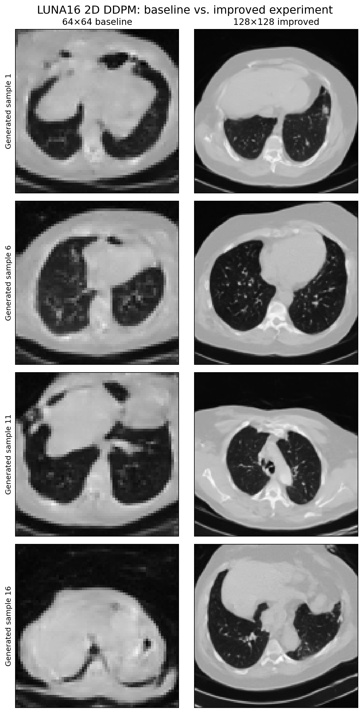
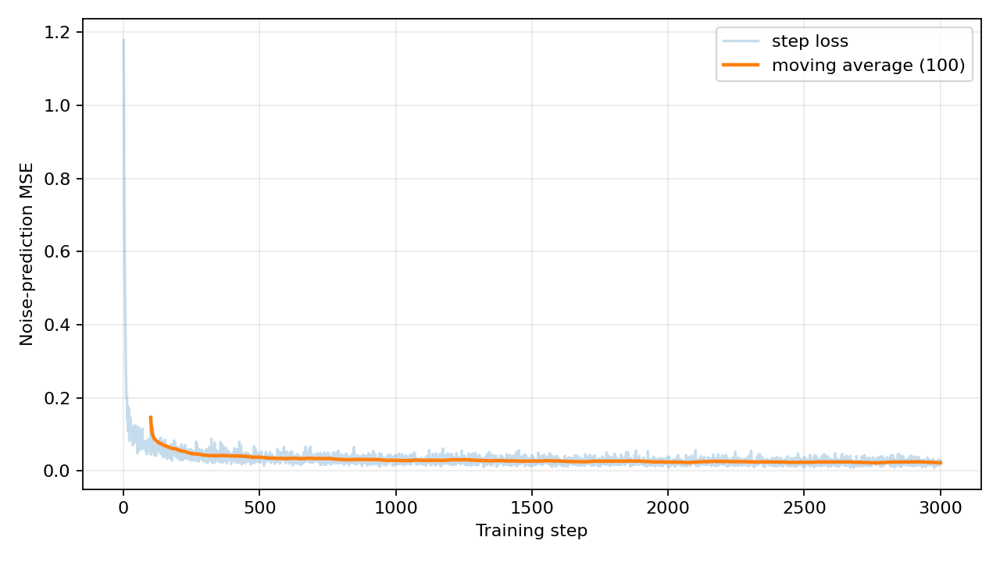
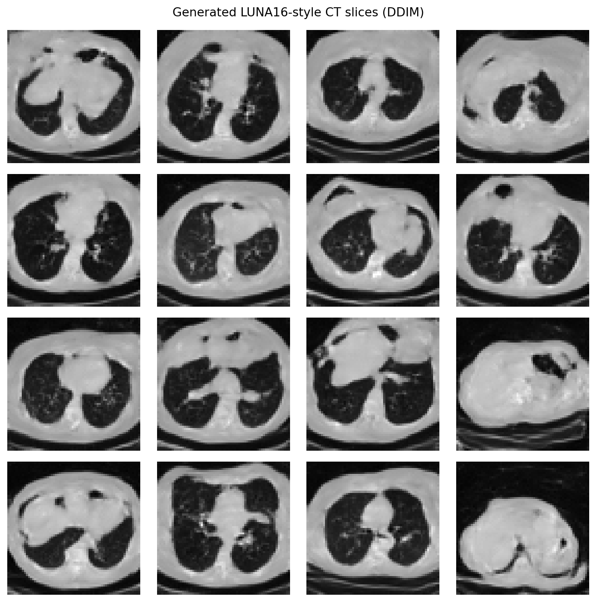
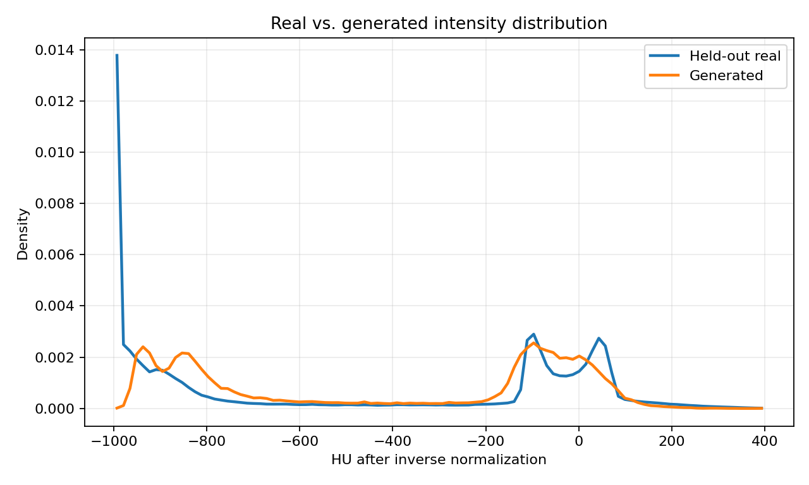
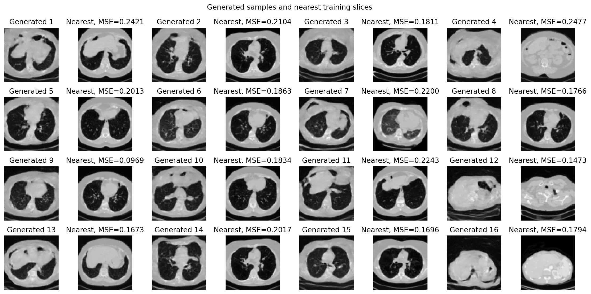
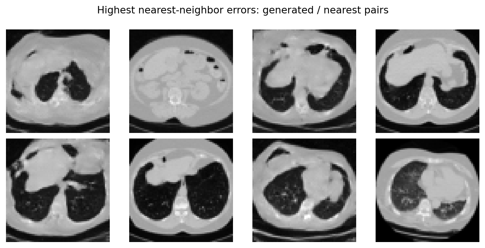

# 基于 LUNA16 的二维肺部 CT 无条件生成实验

**实验性质：本科课程教学演示**  
**实际运行日期：2026-07-29**  
**服务器：NVIDIA GeForce RTX 4090 24 GB，PyTorch 2.8.0+cu128，CUDA 12.8**  

## 1. 研究目的

前期文献综述表明，AE/VAE、GAN、自回归模型、Normalizing Flow 和 Diffusion 等方法均可用于医学图像生成 [@dayarathna2024deep]。本实验不继续比较所有流派，而是实现一个范围明确的工程目标：把公开 LUNA16 三维胸部 CT 转换为二维轴向切片，用轻量级 DDPM 学习这些切片的总体分布，再从随机噪声生成新的单通道 CT 图像。

选择 Diffusion 并不表示它在所有医学任务中必然优于 GAN 或 VAE。医学影像研究已经证明扩散模型是一条常见且可行的生成路线 [@muellerfranzes2023diffusion]；它的训练目标直观、噪声预测较稳定，也适合展示“图像如何从噪声中逐步出现”。本实验只是小规模二维基线，不代表完整的医学图像生成研究。

## 2. 为什么选择 LUNA16

LUNA16 是公开的低剂量胸部 CT 数据集，来源于 LIDC-IDRI。LUNA16 官方页面说明完整数据包含 888 个 CT，并划分为 subset0 到 subset9；每个扫描由一个 `.mhd` 元数据文件和一个 `.raw` 体素文件组成。官方数据与下载说明分别见：

- https://luna16.grand-challenge.org/Data/
- https://luna16.grand-challenge.org/Download/

本次课程实验只使用 **subset0 的 89 个 CT**，而不是完整 888 个扫描。这样既保留了真实 CT 的 HU、spacing 和三维结构，又能在服务器 50 GB 数据盘上快速完成预处理与训练。任务是无条件切片生成，因此没有使用 `annotations.csv`。

## 3. 为什么选择二维 DDPM

完整三维 CT 生成需要更大显存、更长训练时间和更复杂的三维一致性评价。二维方法把一个三维体数据沿 z 轴切成很多 axial 图像，使每一张切片成为一个训练样本。这样会丢失相邻切片之间的关系，却能显著降低模型和数据管线复杂度，适合本科生先跑通“读取—预处理—训练—采样—评价”的完整流程。

DDPM 的标准训练过程在随机时间步向真实图像添加高斯噪声，让网络预测本次加入的噪声 [@ho2020denoising]。与直接预测一张完整 CT 相比，噪声在各时间步具有统一、明确的目标；模型通过学习不同噪声强度下的去噪规律，间接学到胸廓、肺区和软组织的统计结构。

## 4. LUNA16 数据说明

服务器实际下载并核查了 subset0：

| 项目 | 实际值 |
|---|---:|
| `.mhd` 文件 | 89 |
| `.raw` 文件 | 89 |
| 完整配对扫描 | 89 |
| 原始体数据空间尺寸 | 因扫描而异，面内通常为 512×512 |
| 实际划分 | train 71 / validation 9 / test 9 个 CT |

预处理冒烟读取了两个扫描：

- 扫描 A：shape `(121, 512, 512)`，spacing `(0.7617, 0.7617, 2.5) mm`，观测 HU 范围 `[-3024, 2103]`；
- 扫描 B：shape `(119, 512, 512)`，spacing `(0.7422, 0.7422, 2.5) mm`，观测 HU 范围 `[-2048, 3071]`。

这里的 shape 顺序为 SimpleITK 数组的 `(z, y, x)`，spacing 记录顺序为 `(x, y, z)`。

## 5. 数据预处理流程

处理步骤如下：

1. 用 SimpleITK 读取每一对 `.mhd/.raw`，得到真实 HU 三维数组；
2. 沿 z 轴提取 axial 切片；
3. 将 HU 截断到 `[-1000, 400]`，覆盖肺内空气、肺实质和大部分软组织；
4. 要求 `HU > -900` 的非空气像素比例至少为 0.08；
5. 要求 `-1000 < HU < -400` 的肺窗像素比例至少为 0.03；
6. 默认每隔 4 张取一张，减少连续切片重复；
7. 中心裁剪为正方形，再缩放至 `64×64`；
8. 线性归一化到 `[-1, 1]`，保存为 float32 `.npy`；
9. 先用固定随机种子 42 对 **seriesuid** 划分，再保存切片，避免同一 CT 的不同切片跨集合泄漏；
10. 保存 `manifest.csv`、`splits.json` 和 `preprocess_summary.json`。

最终结果为：

| 集合 | CT 数 | 切片数 |
|---|---:|---:|
| Train | 71 | 4524 |
| Validation | 9 | 503 |
| Test | 9 | 706 |
| 合计 | 89 | 5733 |

脚本验证了三个集合的 seriesuid 交集为空，抽查预处理数组尺寸均为 `64×64`。

## 6. DDPM 的基本原理

DDPM 可以分成前向扩散和反向生成两个过程。

**前向扩散**从真实 CT 切片开始，在很多时间步中逐渐加入高斯噪声。时间步较小时，肺和胸廓仍清楚；时间步较大时，图像接近随机噪声。这个过程的目的不是增强数据，而是构造一系列难度逐渐增加、数学形式已知的去噪任务。

**训练阶段**随机选择时间步，生成对应的带噪图像，然后让 U-Net 预测刚才加入的噪声。真实噪声是已知的，因此可直接使用均方误差。模型不是在记忆某一个固定去噪过程，而是在学习“不同噪声强度下，CT 结构通常应怎样恢复”。

**生成阶段**没有真实图像作为起点，而是从一张随机高斯噪声图开始。模型先预测其中应去掉的噪声，再根据扩散调度器更新图像；重复多次后，随机噪声逐渐变成符合训练分布的 CT 样式切片。本实验训练使用 1000 个扩散时间步，最终采样使用 50 步 DDIM，以减少演示等待时间。

## 7. 网络结构和训练配置

噪声预测器是一个小型 2D U-Net：

- 输入/输出：`1×64×64` 灰度张量；
- 基础通道数：64；
- 三次下采样，通道依次扩展到 64、128、256；
- bottleneck 使用残差块和一个自注意力模块；
- 三次上采样并与对应尺度的特征跳跃连接；
- 用正弦时间编码表示当前扩散时间步；
- 可训练参数：**7,522,305**。

正式训练配置：

| 项目 | 配置 |
|---|---:|
| 优化器 | AdamW |
| 学习率 | 1e-4 |
| Weight decay | 1e-4 |
| Batch size | 64 |
| 优化 step | 3000 |
| 扩散训练时间步 | 1000 |
| 采样 | 50-step DDIM，eta=0 |
| 混合精度 | 开启 |
| 梯度裁剪 | 1.0 |
| EMA | 0.999 |
| 随机种子 | 42 |
| GPU | RTX 4090 24 GB |

训练程序每 500 step 保存 EMA 生成预览和 checkpoint；checkpoint 同时包含模型、EMA、优化器、AMP scaler、step、loss 历史和配置，可继续训练。

## 8. 实验结果

| 指标 | 实际结果 |
|---|---:|
| 训练 CT / 切片 | 71 / 4524 |
| 图像尺寸 | 64×64 |
| 模型参数量 | 7,522,305 |
| Batch size | 64 |
| 训练步数 | 3000 |
| 等效数据遍历次数 | 42.44 |
| 训练时间 | 3分21秒 |
| 最终单步 loss | 0.028835 |
| 末 100 步平均 loss | 0.022714 |
| 生成 16 张耗时 | 0.732 秒 |
| 单张平均生成耗时 | 0.0458 秒 |

训练初期 noise-prediction MSE 快速下降，后期在约 0.02～0.04 范围波动。loss 下降只说明模型更准确地预测训练噪声，不等同于临床图像质量。

最终 4×4 生成网格如下：

## 9. 真实图像与生成图像对比

人工观察显示，模型已经学到以下粗粒度结构：

- 黑色图像背景和近似椭圆的身体轮廓；
- 双肺低密度区域；
- 中央纵隔/心脏样软组织；
- 胸壁、脊柱和部分血管样高密度纹理；
- 从上胸、肺底到上腹部的多种轴向层面。

但生成结果比真实切片更平滑，一些肺边界、血管样分叉和左右解剖关系不自然。由于筛选仅基于 HU 比例，训练数据本身仍包括肩部和上腹部切片，模型也学会了生成这些层面。

使用全部 706 张 test 切片估计真实灰度分布，并与 16 张生成图比较：

| 指标 | 真实 test | 生成 |
|---|---:|---:|
| 归一化像素均值 | -0.2685 | -0.1579 |
| 归一化像素标准差 | 0.6513 | 0.5599 |

直方图总变差距离为 **0.3258**。生成图捕捉到了空气/肺区和软组织两个主要灰度区域，但在 `-1000 HU` 附近的截断空气峰值偏低，在约 `-900 HU` 和软组织附近分布更宽。这说明模型只近似了整体灰度分布，尚未完全复现真实 CT 的密度组成。

16 张生成图的两两平均绝对差为 **0.4663**，表明输出并非完全相同；不过该数值同时受切层位置和身体大小影响，不能单独证明有意义的病理多样性。

## 10. 最近邻和失败案例

对每张生成图，在全部 4524 张训练切片中按归一化像素 MSE 搜索最近邻：

- 最近邻 MSE 均值：0.1897；
- 最小值：0.0969；
- 最大值：0.2477。

逐对观察没有发现生成图与最近邻达到像素级一致，说明这 16 张样例没有表现出明显的直接复制。但像素 MSE 对平移、身体大小和解剖层面很敏感，也不能排除更隐蔽的记忆。

按最近邻误差选出的失败样例主要表现为：

- 胸腹交界结构粘连，器官边界模糊；
- 左右肺大小或形态不自然；
- 血管样纹理呈散点或断裂；
- 局部空气腔位置不合理；
- 身体轮廓和床板纹理存在模糊重影。

这些图只能被称为“CT 样式图像”，不能据此判断其中是否存在真实结节、肺炎或其他病变。

## 11. 局限性

1. **仅使用 subset0。** 89 个 CT 不能覆盖完整 LUNA16 的设备、病例和解剖差异。
2. **二维建模。** 相邻切片独立，生成结果没有三维连续性；同一个“患者体积”无法由本模型生成。
3. **分辨率低。** 64×64 相当于把常见 512×512 CT 大幅缩小，微小结节和精细血管会丢失。
4. **切片筛选简单。** HU 比例过滤不能精确限定肺野，因此保留了部分肩部和上腹部图像。
5. **评价规模有限。** 只生成 16 张最终样例；直方图、多样性和最近邻只是初步工程检查。
6. **没有病灶真实性评价。** 没有使用结节标注，也没有验证生成病灶的存在、位置或形态。
7. **没有专家评价。** 未经过放射科医生盲评。
8. **没有隐私攻击测试。** 最近邻不能替代成员推断或训练数据泄露评价。

已有医学图像研究提醒，视觉逼真或分布接近不能保证患者级病理信息正确，生成模型可能改变重要病灶 [@cohen2018distribution]。因此，本实验不能描述为“可用于临床诊断”。

## 12. 后续改进方向

1. 使用完整 subset0–subset9，并保持患者/seriesuid 级划分；
2. 切换到 128×128 或更高分辨率，同时降低 batch size；
3. 使用官方肺野 mask 或自动分割，只训练真正包含肺部的切片；
4. 采用 2.5D、3D latent diffusion 或相邻切片条件，改善空间连续性；三维医学扩散已有可行研究基础 [@khader2023denoising]；
5. 加入层面、肺野 mask 或结节位置条件，开展可控生成；
6. 增加医学域特征距离、结构指标、更多生成样本、隐私攻击和外部数据测试；
7. 如果研究目标转向病灶生成，必须使用 annotations、病灶级指标和放射科医生评价。

## 结论

本实验完成了真实 LUNA16 subset0 的下载、HU 预处理、seriesuid 级无泄漏划分、小型 2D DDPM 训练、EMA checkpoint、DDIM 采样以及灰度、多样性和最近邻评价。模型在 3000 个训练 step 后能够从随机噪声生成具有粗略胸部 CT 外观的 64×64 切片，证明了教学流程可以跑通。

这一结论仅表示模型学习到了部分二维 CT 切片分布。实验没有验证病灶真实性、三维一致性或临床有效性，生成图不能用于任何临床诊断。
