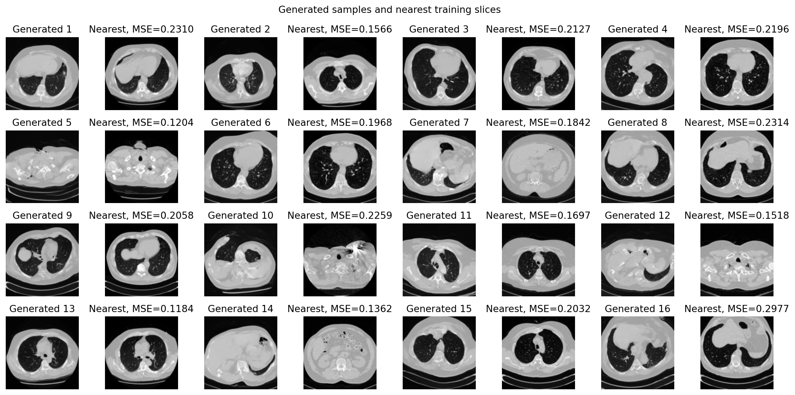
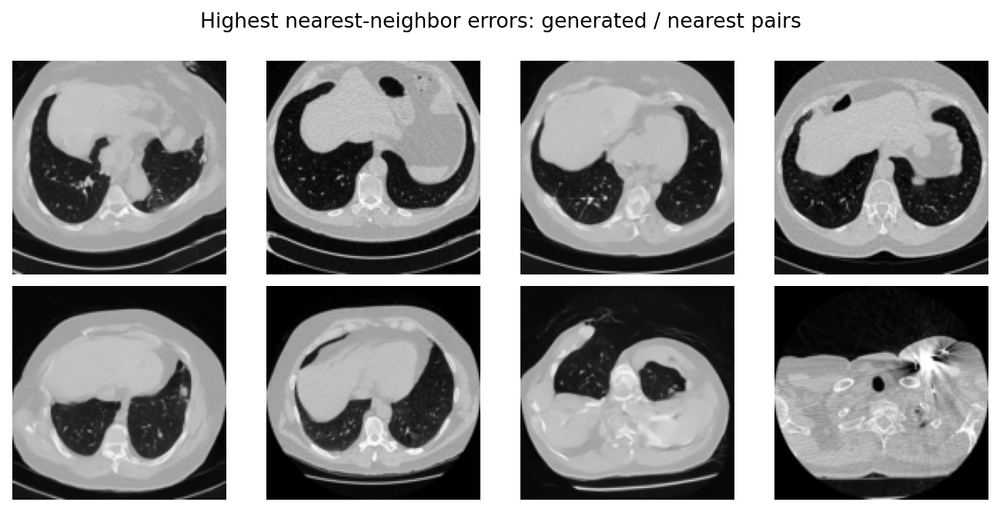

# LUNA16 二维 CT 生成改进实验：128×128 DDPM

## 1. 改进目标

本实验在原有 64×64、3000-step baseline 完整保留的前提下，单独验证提高分辨率、加强肺部切片筛选并延长训练后，轻量级二维 DDPM 是否能生成结构更清晰的胸部 CT 切片。实验仍是教学性质的无条件生成基线，不使用 `annotations.csv`，不针对结节位置或病灶类型进行控制。

## 2. 数据与预处理

实验只使用 LUNA16 `subset0`，未下载其他 subset。SimpleITK 成功读取 89 个 `.mhd/.raw` 扫描，并按 `seriesuid` 固定划分为 71 个训练、9 个验证和 9 个测试扫描，同一扫描的不同切片不会跨集合。

相较 baseline，本实验将切片间隔从 4 调整为 3，并使用以下筛选条件：

- `HU > -900` 的像素比例不低于 0.35；
- `-1000 < HU < -400` 的肺窗像素比例不低于 0.18；
- HU 截断范围仍为 `[-1000, 400]`；
- 中心方形裁剪后缩放至 128×128，并归一化到 `[-1, 1]`。

最终保留 6780 张切片：训练 5361 张、验证 652 张、测试 767 张。预处理耗时 40.1 秒，完整索引见 `data/processed_improved_128/manifest.csv`。

## 3. 冒烟测试

正式训练前，使用最多 1000 张训练切片完成 200-step 冒烟测试：

| 项目 | 结果 |
|---|---:|
| 分辨率 | 128×128 |
| Batch size | 32 |
| 模型参数量 | 7,522,305 |
| 训练时长 | 50.6 秒 |
| Final loss | 0.043806 |
| 最后 100 步平均 loss | 0.048633 |
| 16 张 DDIM 采样耗时 | 1.22 秒 |

DataLoader、前向计算、反向传播、AMP、EMA、checkpoint 保存和 `sample.py` 采样均通过。冒烟产物保存在 `outputs/improved_128/smoke/` 与 `checkpoints/improved_128/smoke/`。

## 4. 正式训练配置

| 项目 | 配置 |
|---|---:|
| GPU | NVIDIA GeForce RTX 4090 |
| PyTorch / CUDA | 2.8.0+cu128 / 12.8 |
| 分辨率 | 128×128，单通道 |
| 模型 | 轻量二维 U-Net，7,522,305 参数 |
| Batch size | 32 |
| 优化器 | AdamW |
| 学习率 | 1e-4 |
| 扩散时间步 | 1000 |
| 训练步数 | 10000 |
| 混合精度 / EMA | 开启 / 0.999 |
| 梯度裁剪 | 1.0 |
| 采样 | 50-step DDIM，eta=0 |

正式训练通过 `nohup` 在服务器后台执行，日志写入 `logs/improved_128/train.log`。实测显存约 4.96 GB，GPU 利用率约 91%–97%。

## 5. 正式实验结果

| 项目 | 结果 |
|---|---:|
| 训练切片 / 扫描 | 5361 / 71 |
| 完成步数 | 10000 |
| 训练时长 | 10分56秒 |
| Final batch loss | 0.005591 |
| 最后 100 步平均 loss | 0.018469 |
| 16 张生成耗时 | 1.222 秒 |
| 灰度直方图 TV 距离 | 0.245155 |
| 生成样本两两平均绝对差 | 0.488147 |
| 最近邻平均 MSE | 0.191339 |


生成结果已学习到胸廓边界、双肺低密度区域、心脏与纵隔软组织、椎体以及肺内血管样纹理。不同样本覆盖上胸、心脏层面、肺底和部分上腹层面，说明模型并非只输出单一形态。

## 6. 与 64×64 baseline 的比较

| 指标 | 64×64 baseline | 128×128 improved |
|---|---:|---:|
| 训练步数 | 3000 | 10000 |
| 训练切片数 | 4524 | 5361 |
| 最后 100 步平均 loss | 0.022714 | 0.018469 |
| 灰度直方图 TV，越低越接近 | 0.325842 | 0.245155 |
| 样本两两平均绝对差 | 0.466270 | 0.488147 |
| 最近邻平均 MSE | 0.189714 | 0.191339 |

128×128 实验的直方图 TV 更低，生成样本的灰度分布更接近留出测试集；样本多样性指标略高。最近邻平均 MSE 与 baseline 接近，结合最近邻可视化，没有发现生成图片与训练切片像素级相同的情况。上述数值只能说明当前教学实验中的分布拟合和初步记忆检查，不能作为临床真实性指标。



## 7. 失败案例与局限性

失败样例仍表现为：

- 膈肌、心缘或上腹器官边界模糊；
- 个别样本左右肺或纵隔比例不自然；
- 骨性高密度区域和肺内血管样纹理出现伪影；
- 二维模型不具备相邻切片间的三维一致性；
- subset0 数据量有限，筛选规则仍会保留部分肩部和上腹层面；
- 最近邻 MSE 和灰度直方图不能验证病灶真实性或解剖合理性。



本实验仅用于本科课程汇报，验证模型能否学习二维 CT 切片的大致分布。结果未经过放射科医生评价，未验证结节或其他病灶真实性，也未验证临床安全性，不能用于诊断、治疗或任何临床决策。

## 8. 复现命令

```bash
# 128×128 预处理
python preprocess.py --config configs/improved_128.yaml

# 200-step 冒烟测试
python train.py \
  --config configs/improved_128.yaml \
  --set train.max_steps=200 \
  --set train.max_train_slices=1000 \
  --set paths.outputs_dir=outputs/improved_128/smoke \
  --set paths.checkpoints_dir=checkpoints/improved_128/smoke \
  --set train.save_every=200 \
  --set train.sample_every=200

# 10000-step 正式训练；连接断开后仍继续
mkdir -p logs/improved_128
nohup python train.py \
  --config configs/improved_128.yaml \
  > logs/improved_128/train.log 2>&1 < /dev/null &

# 最终采样与评估
python sample.py \
  --config configs/improved_128.yaml \
  --checkpoint latest.pt \
  --count 16
python evaluate.py \
  --config configs/improved_128.yaml
```

## 9. DDIM 采样步数补充实验

### 9.1 实验设置

本补充实验不重新训练模型，直接加载同一个 10000-step EMA checkpoint。分别使用 50、100 和 200 步 DDIM 生成 16 张图像；三组均采用 seed 42、`eta=0`，并在每次采样前重置随机数生成器，因此初始噪声完全相同。这样可以把观察到的差异主要归因于反向采样离散步数，而不是不同随机样本。

```bash
python sampling_steps_experiment.py \
  --config configs/improved_128.yaml \
  --checkpoint latest.pt \
  --count 16 \
  --steps 50 100 200
```

### 9.2 耗时与辅助图像统计

| DDIM 步数 | 16 张总耗时 | 单张平均耗时 | 平均绝对梯度 | 平均绝对 Laplacian |
|---:|---:|---:|---:|---:|
| 50 | 0.910 秒 | 0.0569 秒 | 0.06041 | 0.13379 |
| 100 | 1.179 秒 | 0.0737 秒 | 0.06561 | 0.14761 |
| 200 | 2.353 秒 | 0.1471 秒 | 0.06956 | 0.15994 |

平均梯度和 Laplacian 随步数增加，说明输出中的局部灰度变化和高频成分增多；但这两个数值同时会受到真实边缘、血管样纹理、噪点和伪影影响，不能据此直接判定医学图像质量更好。


### 9.3 基于实际图像的比较

**肺边界。** 在对比图的第 1、6 和 11 号固定噪声样本中，100/200 步的部分胸膜线、膈肌边缘和纵隔交界比 50 步略清楚，轮廓的平滑模糊有所减轻。不过改进幅度不一致：一些样本在 50 步已经形成稳定边界，增加到 200 步没有带来明显的整体轮廓收益。

**血管样纹理。** 第 6 和 11 号样本中，100/200 步肺野内的细小亮线和点状分支更突出，与平均绝对梯度增加的结果一致。这里应称为“血管样纹理”，因为本实验没有血管标注，也没有验证这些分支是否符合真实血管树。

**局部伪影与解剖结构。** 更多采样步数并非始终改善结果。第 2 号样本在 100/200 步出现大面积软组织占位和很小的单侧肺样区域，解剖合理性反而弱于其 50 步版本；部分 200 步样本还出现更强的颗粒状高频纹理、不规则高密度点或胸腹部结构漂移。肩部、肺底和上腹层面的异常也没有因为采样步数增加而自动消失。较高的 Laplacian 数值因此既包含更清楚的细节，也可能包含更明显的伪影。

**综合判断。** 在这 16 个固定噪声样本中，100 步通常能以较小的额外耗时提供比 50 步更明显的局部纹理，可作为展示时的折中设置；200 步在部分样本上进一步锐化细节，但耗时约为 100 步的两倍，而且没有稳定改善解剖合理性。因此不能只根据采样步数排序效果，也不能由本次 16 张图的小样本比较宣布某一步数普遍最优。

### 9.4 对失败模式的针对性改进

- **边界模糊：** 增加采样步数有时可以缓解，但还应考虑提高模型容量，并加入轮廓、梯度或分割一致性等结构损失；仅增加推理步数无法弥补训练模型没有学到的结构。
- **解剖不自然：** 可加入轴向切片位置、肺部 mask 或解剖区域标签作为条件，使模型知道当前应生成上胸、肺门、肺底还是上腹邻近层面。
- **二维连续性：** 独立二维模型把每张切片单独生成，无法从根本上保证相邻切片连续。要解决跨层结构跳变，需要使用相邻切片作为输入的 2.5D 方法，或直接使用三维卷积/三维扩散模型。

本补充实验仍未进行放射科医生评价，以上比较只描述当前样本的视觉现象与计算耗时，不代表病灶真实性或临床有效性。

